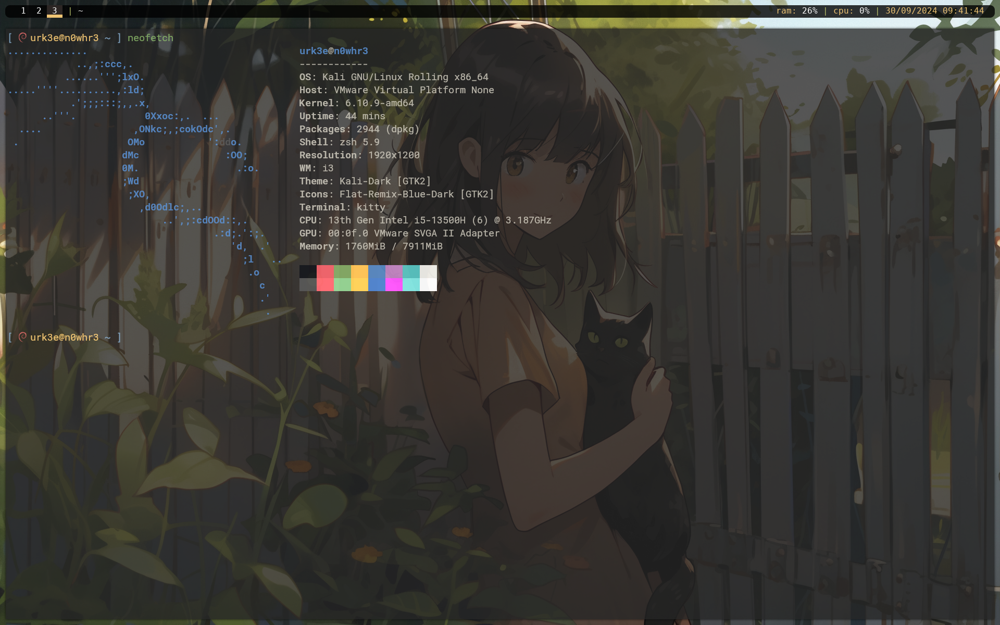

My noob setup for i3wm in debian (Specifically Kali Linux).

There is still a lot of bug, but feel free to use my configuration.

Dependencies needed:
- oh-my-posh
- ohmyzsh
    - fast-syntax-hihglighting
- picom (im using from the kali linux repository)
- kitty terminal
- i3wm
- polybar
- maim
- xclip
- copyq

-----------------------------------------------------------

~ urk3e
